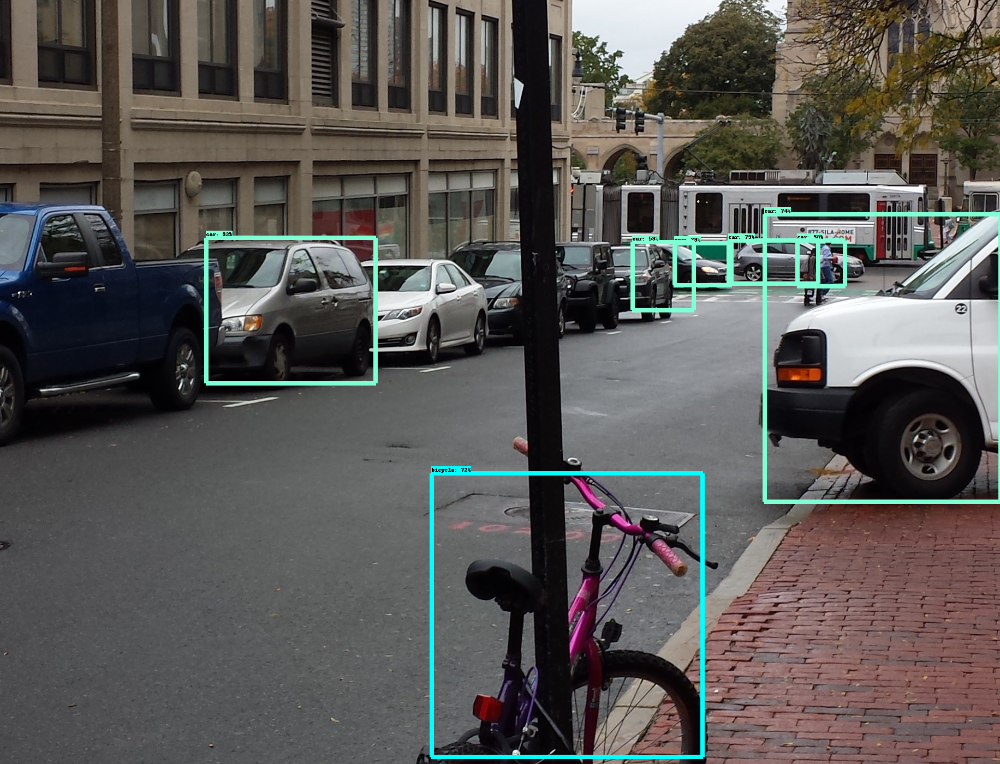
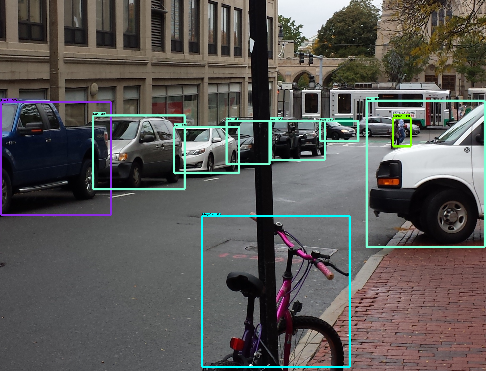

# objectDetection
Object Detection tests on various Google pretained models

### Output from SSD_MOBILENET

### Output from SSD_INCEPTIONNET

### Output from RCNN_INCEPTION_RESNET

### Per Image Stats

| Stats\Model    | MOBILENET | INCEPTIONNET  | RCNN_INCEPTION_RESNET |
|----------------|-----------|---------------|-----------------------|
| Detection time | ~180ms    | ~250ms        | ~24s                  |
| Model Size     | ~30MB     | ~100MB        | ~250MB                |
